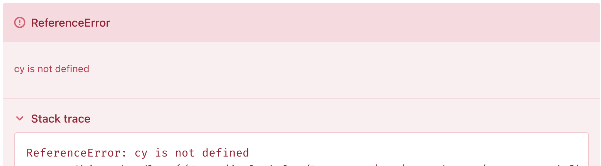

# Cypress-Undefined

This is a reproducer for an error where the `cy` and `Cypress` global objects are undefined in the cypress configuration file (`cypress.config.js`). 

## How to reproduce

Install dependencies

```bash
yarn install
```

Run cypress

```bash
yarn cy:open
```

You may have to wait a while, I found that hitting Command + S to save a file triggers the timeout to stop and to spit out the error. You should see this error in the cypress window:

```
ReferenceError: cy is not defined
```



